# Generador_historias_API germangarest


## Índice de Contenidos

1. [📖 Descripción](#-1-descripción)
   - [🚀 Características Principales](#-características-principales)
   - [✏️ System Prompt usado](#-system-prompt-usado)
   - [🖋️ User Prompt usado](#-user-prompt-usado)
   - [🆙 Botón de descarga](#-botón-de-descarga)
2. [🛠️ Instalación](#-2-instalación)
   - [❓Requisitos previos](#-requisitos-previos)
   - [👣Pasos de instalación](#-pasos-de-instalación)
3. [🖥️ Uso](#-3-uso)
   - [💻 Interfaz de usuario](#-interfaz-de-usuario)
   - [✍️ Crear historia](#-crear-historia)
   - [📓 Guía de uso](#-guía-de-uso)
4. [✍️ Ejemplos de historias generadas](#-4-ejemplos-de-historias-generadas)
   - [📋 Parámetros de generación](#-parámetros-de-generación)
   - [🛠️ Modelos utilizados](#-modelos-utilizados)
   - [🏆 Mejor historia](#-mejor-historia)
     - [💬 Respuestas de ChatGPT para cada modelo](#-respuestas-de-chatgpt-para-cada-modelo)
     - [📜 Conclusión](#-conclusión)
5. [🛠️ Configuración avanzada y creatividad](#-5-configuración-avanzada-y-creatividad)
6. [📜 Licencia](#-6-licencia)
7. [🤝 Contribuciones](#-7-contribuciones)
8. [📫 Contacto](#-8-contacto)
   
<br>

## 📖 1. Descripción

**Generador de historias germangarest** es una aplicación web interactiva hecha con Gradio, que utiliza modelos de IA en local para crear historias únicas y cautivadoras. Con una interfaz amigable, permite a los usuarios personalizar personajes, escenarios, acciones clave y estilos narrativos para generar relatos adaptados a sus preferencias. Ideal para cualquier persona que busque inspiración creativa.

---

### 🚀 Características Principales

- **Modelos de IA variados**: selecciona entre 4 modelos de IA generativa: 
    - Ministral 8B Instruct
    - Gemma 2 9B
    - Meta Llama 3.1 8B
    - Qwen2.5 7B
- **Controles creativos**: ajusta parámetros como la temperatura, diversidad (Top-P) y penalización de repetición para personalizar la generación.
- **Longitud personalizable**: elige entre historias cortas, medias o largas según tus necesidades.
- **Incorporación de diálogos**: decide si deseas incluir conversaciones naturales entre los personajes.
- **Descarga fácil**: guarda tus historias generadas en formato TXT directamente en tu carpeta de *descargas*.
- **Guía de uso integrada**: accede a una guía detallada para entender todas las funcionalidades.

---

### ✏ System Prompt usado:
Eres un escritor creativo especializado en crear historias cautivadoras.
Tu tarea es escribir {longitud de la historia en tokens} en el género de {género}.

Ajusta tu estilo según estos parámetros:
- Creatividad: {temperatura} (0=conservador, 1=muy creativo)
- Diversidad de vocabulario: {diversidad} (mayor valor = vocabulario más rico)
- Repetición: {repetición} (mayor valor = menos repeticiones)

La historia debe tener un título atractivo en la primera línea, separado del contenido por una línea en blanco.
El título debe ser conciso y cautivador, sin usar caracteres especiales ni formatos.

Escribe de manera fluida y natural, sin preocuparte por el conteo exacto de palabras. (Esta instrucción la ponemos pues sino se cortaba la historia a mitad puesto que llegaba justo a ese número de palabras)

---

### 🖋 User Prompt usado:
Escribe una historia sobre {personaje principal} y {personaje secundario} en {lugar}, donde {acción clave}.
La historia debe ser {diálogo (sí o no}.

Con creatividad {temperatura}:
- Si es bajo (0-0.3): mantén la narrativa más predecible y coherente
- Si es medio (0.4-0.7): equilibra creatividad con coherencia
- Si es alto (0.8-1.0): sé más experimental y único

El formato debe ser así:
[Título de la historia]

[Contenido de la historia...]

---

### 🆙 Botón de descarga:
Con cada historia generada, aparece una opción de descargar la historia, guardándose en formato .txt en la carpeta *Descargas*.


<br>

---

## 🛠 2. Instalación

### ❓ Requisitos previos

- **Python**
- **Gradio**
- **Dependencias** listadas en `requirements.txt`

### 👣 Pasos de instalación

1. **Clona el repositorio**

   ```
   git clone https://github.com/tu-usuario/generador-historias-germangarest.git
   cd generador-historias-germangarest
   ```

2. **Crea un entorno virtual (opcional)**

  ```
  python -m venv venv
  source venv\Scripts\activate
  ```

3. **Instala las dependencias**
   
   ```
   pip install -r requirements.txt
   ```

4. **Configura las variables de entorno**
   
   ```
   API_URL=http://localhost:7860/v1/chat/completions
   ```

5. **Ejecuta la aplicación**
   
   ```
   python app.py
   ```

6. **Accede a la aplicación**
    
   Abre tu navegador y visita ```http://localhost:5000``` para comenzar a generar tus historias.
   
<br>

---

## 🖥 3. Uso

### 💻 Interfaz de usuario

La interfaz de **Generador de historias germangarest** está dividida en dos pestañas principales:

- **✍ Crear historia**
- **ℹ Guía de uso**

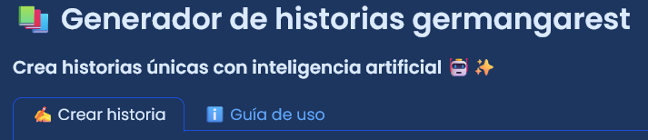
  
<br>

---

### ✍ Crear historia

Aquí puedes personalizar y generar tus historias. A continuación se describen los componentes principales:

- **👥 Personajes**
  - **🌟 Personaje principal**: nombre del protagonista (Por defecto: Germán).
  - **👤¡ Personaje secundario**: nombre del acompañante (Por defecto: Carlos).

- **📍 Lugar y 🎯 acción clave**
  - **📍 Lugar**: escenario donde transcurre la historia (Por defecto: una playa desierta).
  - **🎯 Acción clave**: evento crucial en la trama (Por defecto: practicar surf en verano).
 
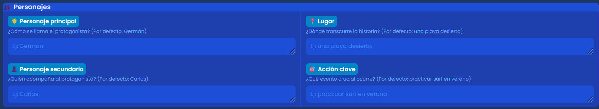

- **🎨 Estilo de la historia**
  - **🤖 Modelo de IA**: selecciona el modelo de lenguaje.
  - **📚 Género**: elige el género de la historia.
  - **🌡 Temperatura (creatividad)**: controla la creatividad del texto.
  - **📏 Longitud**: define la extensión de la historia.
 
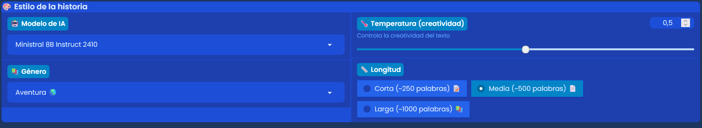

- **⚙ Configuración avanzada**
  - **💬 Incluir diálogos**: decide si incluir conversaciones.
  - **🎲 Diversidad (Top-P)**: variedad del vocabulario.
  - **🔄 Penalización de repetición**: evita repeticiones en el texto.
 
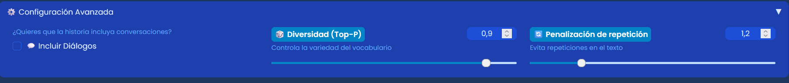

- **Botones y Salidas**
  - **✨ Generar Historia ✨**: inicia la generación.
  - **📥 Descargar historia**: descarga la historia generada en formato TXT.
 
Interfaz de la aplicación web Gradio:

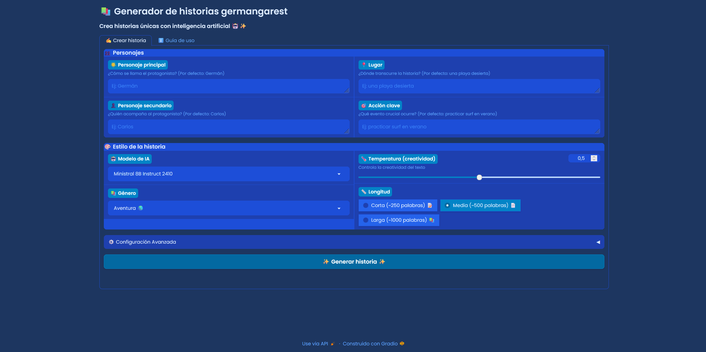
    
<br>

### 📓 Guía de uso

Accede a una guía detallada sobre cómo utilizar la aplicación, incluyendo explicaciones de cada parámetro y consejos para obtener mejores resultados.

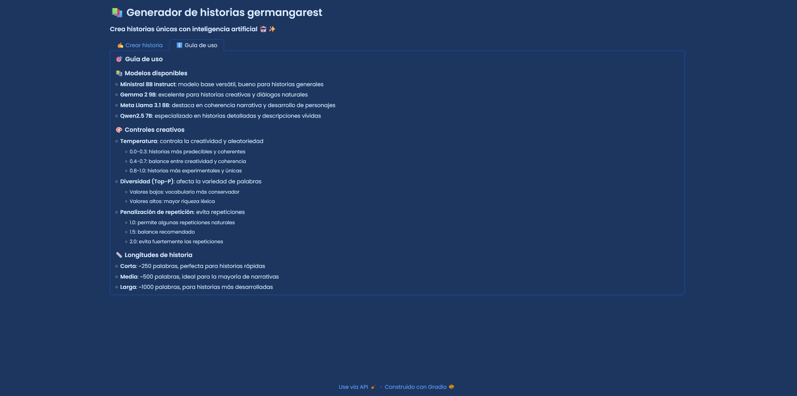

<br>

---

## ✍ 4. Ejemplos de historias generadas

Voy a usar cada uno de los 4 modelos para generar una misma historia. Así, podré elegir cuál de los 4 modelos se comporta de mejor manera en la generación de historias con esos parámetros.

### 📋 Parámetros de generación

- **Personaje principal:** Juan
- **Personaje secundario:** Álvaro
- **Lugar:** supermercado
- **Acción clave:** comprar en invierno
- **Género:** misterio
- **Temperatura:** 0.5
- **Longitud:** corta (aprox. 250 palabras)
- **Configuración avanzada:** se deja por defecto

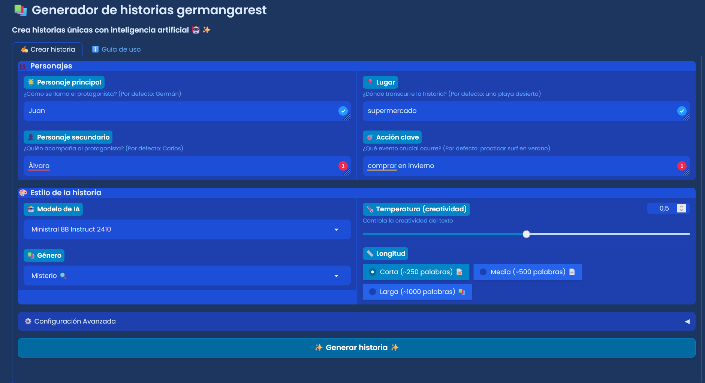

---

### 🛠 Modelos utilizados

#### 1. Modelo Ministral 8B Instruct

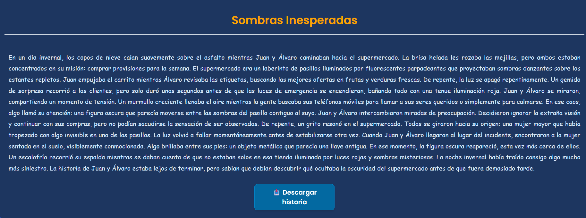

- **Palabras:** 338
- **Párrafos:** 8

#### 2. Modelo Gemma 2 9B

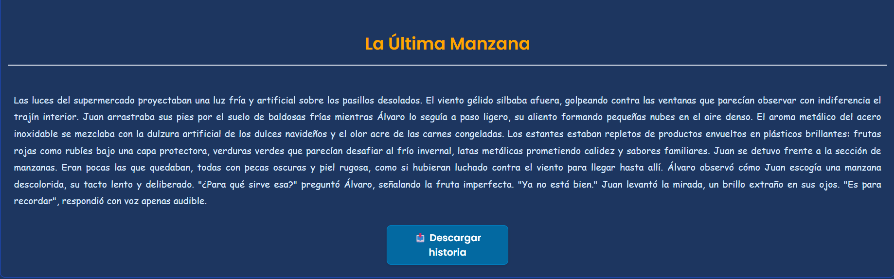

- **Palabras:** 191
- **Párrafos:** 6

#### 3. Modelo Meta Llama 3.1 8B

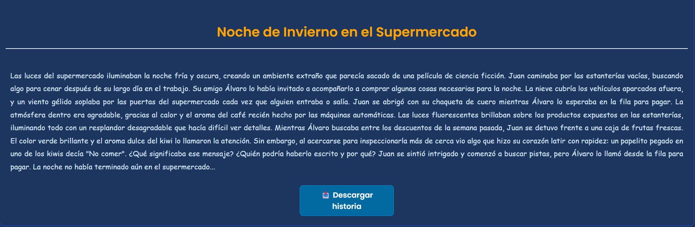

- **Palabras:** 240
- **Párrafos:** 6

#### 4. Modelo Qwen2.5 7B

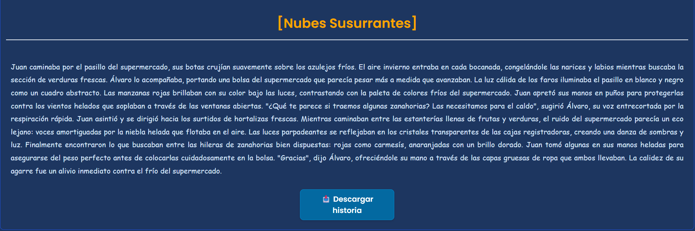

- **Palabras:** 257
- **Párrafos:** 7

---

### 🏆 Mejor historia

En mi opinión, la mejor historia es la generada por **Ministral 8B**, dado que aunque la extensión es mayor, no se queda corta de caracteres y además es una historia bastante cautivadora.

Voy a pedirle opinión a **ChatGPT o1-mini**, con el siguiente prompt:

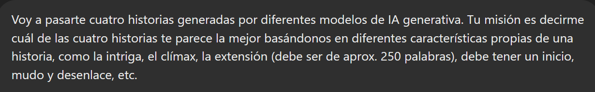

---

#### 💬 Respuestas de ChatGPT para cada modelo

##### Modelo Ministral 8B Instruct

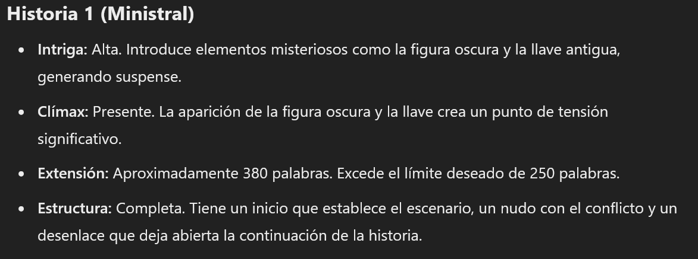

##### Modelo Gemma 2 9B

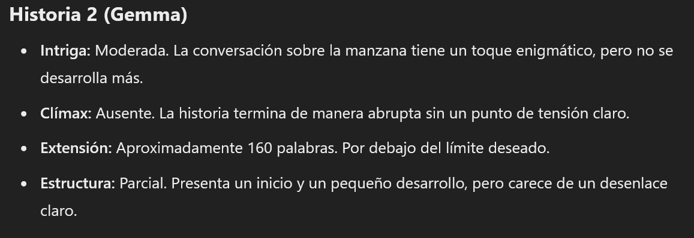

##### Modelo Meta Llama 3.1 8B

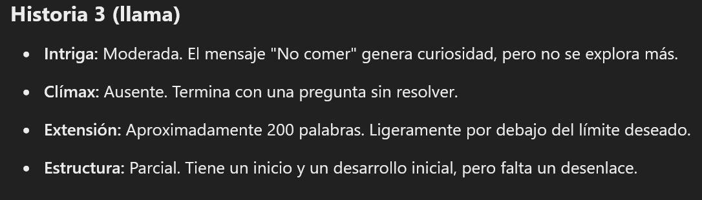

##### Modelo Qwen2.5 7B

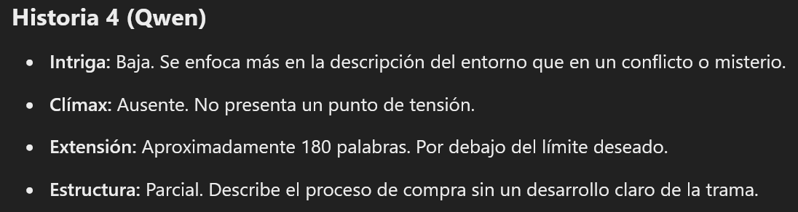

---

#### 📜 Conclusión

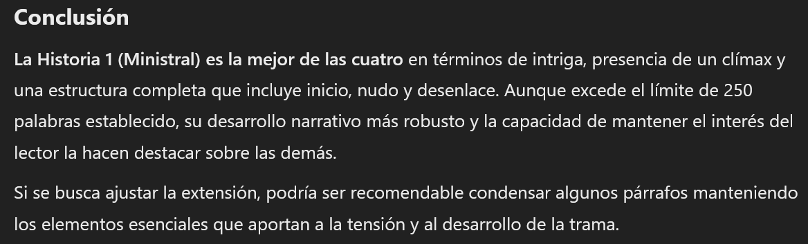

Dado que tanto ChatGPT como yo coincidimos en el mejor modelo para generar una historia de estas características, el ganador resulta ser:

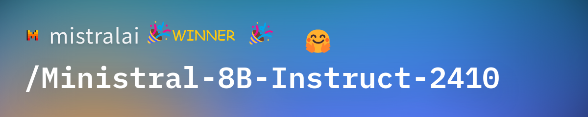

<br>

---

## 🛠 5. Configuración avanzada y creatividad

Puedes personalizar aún más la generación de historias utilizando los controles avanzados. Para ello, voy a mostrar unas historias de ejemplo con el modelo Ministral, pues fue el ganador:

- **Incluir diálogos**: activa esta opción para que los personajes interactúen mediante conversaciones naturales.

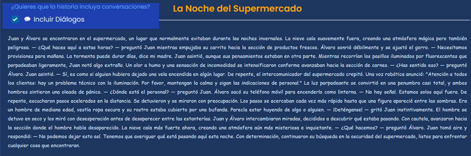

- **Diversidad (Top-P)**: ajusta este parámetro para controlar la variedad léxica. Valores más altos generan un vocabulario más rico.

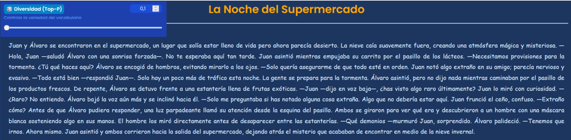
  
- **Penalización de repetición**: incrementa este valor para evitar que la IA repita frases o palabras.


- **Creatividad**: probamos con un valor de 1 en la temperatura.

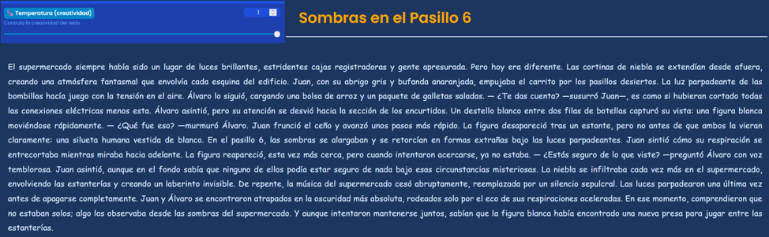

<br>

---

## 📜 6. Licencia

Este proyecto está licenciado bajo la Licencia MIT. Consulta el archivo [LICENSE](LICENSE) para más detalles.

<br>

---

## 🤝 7. Contribuciones

¡Las contribuciones son bienvenidas! Si deseas mejorar este proyecto, por favor sigue estos pasos:

1. **Fork** el repositorio.
2. **Crea una rama** para tu característica (`git checkout -b feature/nueva-caracteristica`).
3. **Commit** tus cambios (`git commit -m 'Añadir nueva característica'`).
4. **Push** a la rama (`git push origin feature/nueva-caracteristica`).
5. **Abre un Pull Request**.
   
<br>

---

## 📫 8. Contacto

Si tienes alguna pregunta o sugerencia, no dudes en contactarme directamente a mi [LinkedIn](https://www.linkedin.com/in/germangarest)🧑‍💼.
