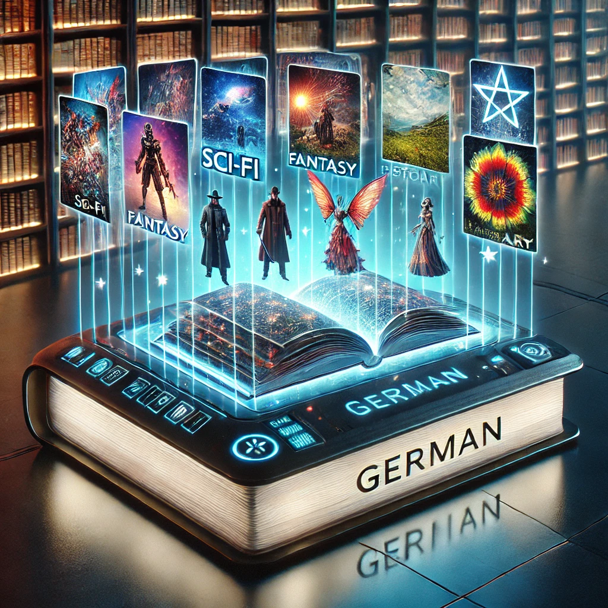

# Generador_historias_API germangarest


## Índice de Contenidos

1. [Descripción](#--descripción)
2. [Instalación](#-instalación)
3. [Uso](#-uso)
   - [Interfaz de Usuario](#interfaz-de-usuario)
   - [Capturas de Pantalla](#-capturas-de-pantalla)
   - [Ejemplos de Historias Generadas](#-ejemplos-de-historias-generadas)
4. [Configuración Avanzada](#-configuración-avanzada)
5. [Licencia](#-licencia)
6. [Contribuciones](#-contribuciones)
7. [Contacto](#-contacto)
   
<br>

## 📖 1. Descripción

**Generador de Historias Germangarest** es una aplicación web interactiva que utiliza inteligencia artificial para crear historias únicas y cautivadoras. Con una interfaz amigable basada en Gradio, permite a los usuarios personalizar personajes, escenarios, acciones clave y estilos narrativos para generar relatos adaptados a sus preferencias. Ideal para escritores, educadores o cualquier persona que busque inspiración creativa.

### 🚀 Características Principales

- **Modelos de IA Variados**: Selecciona entre múltiples modelos de lenguaje para adaptar el estilo y la coherencia de la historia.
- **Controles Creativos**: Ajusta parámetros como la temperatura, diversidad (Top-P) y penalización de repetición para personalizar la generación.
- **Longitud Personalizable**: Elige entre historias cortas, medias o largas según tus necesidades.
- **Incorporación de Diálogos**: Decide si deseas incluir conversaciones naturales entre los personajes.
- **Descarga Fácil**: Guarda tus historias generadas en formato TXT directamente en tu carpeta de Descargas.
- **Guía de Uso Integrada**: Accede a una guía detallada para aprovechar al máximo todas las funcionalidades.
  
<br>

## 🛠️ 2. Instalación

### Requisitos previos

- **Python**
- **Gradio**
- **Dependencias** listadas en `requirements.txt`

### Pasos de instalación

1. **Clona el repositorio**

   ```
   git clone https://github.com/tu-usuario/generador-historias-germangarest.git
   cd generador-historias-germangarest
   ```

2. **Crea un entorno virtual (opcional)**

  ```
  python -m venv venv
  source venv\Scripts\activate
  ```

3. **Instala las dependencias**
   
   ```
   pip install -r requirements.txt
   ```

4. **Configura las variables de entorno**
   
   ```
   API_URL=http://localhost:7860/v1/chat/completions
   ```

5. **Ejecuta la Aplicación**
   
   ```
   python app.py
   ```

6. **Accede a la Aplicación**
    
   Abre tu navegador y visita ```http://localhost:5000``` para comenzar a generar tus historias.
   
<br>

## 🖥️ 3. Uso

### Interfaz de Usuario

La interfaz de **Generador de Historias Germangarest** está dividida en dos pestañas principales:

- **✍️ Crear Historia**
- **ℹ️ Guía de Uso**
  
<br>

### ✍️ Crear Historia

Aquí puedes personalizar y generar tus historias. A continuación se describen los componentes principales:

- **👥 Personajes**
  - **🌟 Personaje Principal**: Nombre del protagonista (Por defecto: Germán).
  - **👤 Personaje Secundario**: Nombre del acompañante (Por defecto: Carlos).

- **📍 Lugar y 🎯 Acción Clave**
  - **📍 Lugar**: Escenario donde transcurre la historia (Por defecto: una playa desierta).
  - **🎯 Acción Clave**: Evento crucial en la trama (Por defecto: practicar surf en verano).

- **🎨 Estilo de la Historia**
  - **🤖 Modelo de IA**: Selecciona el modelo de lenguaje.
  - **📚 Género**: Elige el género de la historia.
  - **🌡️ Temperatura (Creatividad)**: Controla la creatividad del texto.
  - **📏 Longitud**: Define la extensión de la historia.

- **⚙️ Configuración Avanzada**
  - **💬 Incluir Diálogos**: Decide si incluir conversaciones.
  - **🎲 Diversidad (Top-P)**: Variedad del vocabulario.
  - **🔄 Penalización de Repetición**: Evita repeticiones en el texto.

- **Botones y Salidas**
  - **✨ Generar Historia ✨**: Inicia la generación.
  - **📥 Descargar historia**: Descarga la historia generada en formato TXT.
    
<br>

### ℹ️ Guía de Uso

Accede a una guía detallada sobre cómo utilizar la aplicación, incluyendo explicaciones de cada parámetro y consejos para obtener mejores resultados.
**captura de pantalla**

<br>

### 🖼️ Capturas de Pantalla

#### Pantalla Principal


#### Generación de Historia


#### Historia Generada


<br>

## ✍️ Ejemplos de Historias Generadas

### Ejemplo 1: Aventura en la Playa

**Título: La Ola Perfecta**

En una playa desierta, Germán se preparaba para su rutina diaria de surf. El sol brillaba intensamente, reflejándose en las olas cristalinas. Carlos, su mejor amigo, lo acompañaba para observar su progreso. De repente, una ola gigantesca emergió en el horizonte, más grande que cualquier otra que habían visto antes. Germán sintió una mezcla de emoción y nerviosismo. Decidió enfrentarse al desafío, remando con todas sus fuerzas hacia la ola perfecta. Con una habilidad impresionante, logró montar la ola desde el inicio hasta el final, sintiendo una euforia indescriptible. Al final del día, ambos amigos celebraron la hazaña, sabiendo que habían vivido una experiencia inolvidable.

### Ejemplo 2: Misterio en la Ciudad

**Título: El Secreto del Relojero**

Germán, un detective novato, llegó a la antigua tienda de relojes de la ciudad. El dueño, un hombre de aspecto misterioso llamado Carlos, le pidió ayuda para resolver una serie de desapariciones recientes. Cada víctima había sido vista por última vez cerca de la tienda. Germán comenzó a investigar y descubrió un compartimento secreto detrás de uno de los relojes. Dentro, encontró diarios antiguos que hablaban de un tesoro escondido y de rituales oscuros realizados por el relojero. Con esta información, Germán desentrañó la verdad detrás de las desapariciones y logró detener al culpable, revelando el secreto que Carlos había guardado durante décadas.

<br>

## 🛠️ 4. Configuración Avanzada

Puedes personalizar aún más la generación de historias utilizando los controles avanzados:

- **Incluir Diálogos**: Activa esta opción para que los personajes interactúen mediante conversaciones naturales.
- **Diversidad (Top-P)**: Ajusta este parámetro para controlar la variedad léxica. Valores más altos generan un vocabulario más rico.
- **Penalización de Repetición**: Incrementa este valor para evitar que la IA repita frases o palabras.

### 📷 Capturas de Pantalla

#### Interfaz de Generación


#### Historia con Diálogos


<br>

## 📜 5. Licencia

Este proyecto está licenciado bajo la Licencia MIT. Consulta el archivo [LICENSE](LICENSE) para más detalles.

<br>

## 🤝 6. Contribuciones

¡Las contribuciones son bienvenidas! Si deseas mejorar este proyecto, por favor sigue estos pasos:

1. **Fork** el repositorio.
2. **Crea una rama** para tu característica (`git checkout -b feature/nueva-caracteristica`).
3. **Commit** tus cambios (`git commit -m 'Añadir nueva característica'`).
4. **Push** a la rama (`git push origin feature/nueva-caracteristica`).
5. **Abre un Pull Request**.
   
<br>

## 📫 7. Contacto

Si tienes alguna pregunta o sugerencia, no dudes en contactarme directamente a mi [LinkedIn](https://www.linkedin.com/in/germangarest)🧑‍💼.
